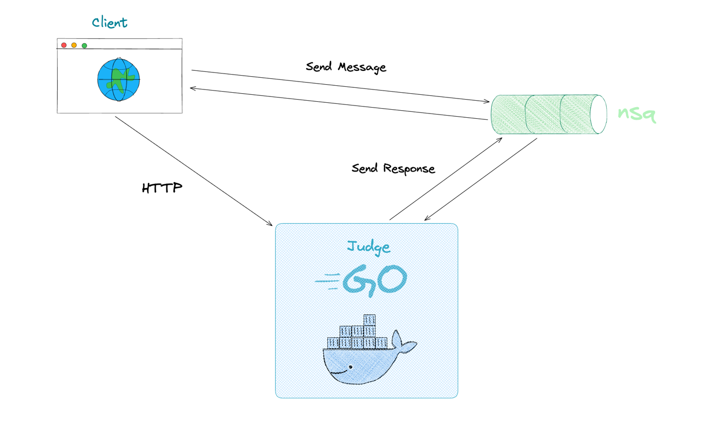

# Judge

[](https://pkg.go.dev/github.com/axliupore/judge) [](https://goreportcard.com/report/github.com/axliupore/judge)

[中文文档](README.cn.md)

A code sandbox implemented in Golang, aimed at providing a secure, reliable, and efficient containerized environment for
running code. Developers only need to provide the programming language and code content to obtain the results of code
execution. The underlying containers of this project use [go-judge](https://github.com/criyle/go-judge).

## Supported Languages

|  Language  | Version |
|:----------:|:-------:|
|    C++     |   17    |
|     C      |   17    |
|   Golang   |  1.19   |
|    Java    |   17    |
|   Python   | 3.11.2  |
| JavaScript |   18    |
| TypeScript |  5.53   |

## Quick Start

### Installation and Running

Clone the project:

```bash
git clone git@github.com:axliupore/judge
```

In the root directory, run the following commands:

```bash
make all
make run
```

Or use Docker without Nsq by simply running the following command:

```bash
docker run -d --privileged --shm-size=2048m -p 6048:6048 --name=judge trialoj/judge --http=6048
```

If using Nsq, you need to specify where Nsq is running. By default, Nsq is placed on the host machine in this project:

```bash
docker run -d --privileged --shm-size=2048m -p 6048:6048 --name=judge --add-host="host.docker.internal:host-gateway" trialoj/judge --http=6048
```

### Http

```bash
curl -X POST -H "Content-Type: application/json" -d '[{"language": "cpp", "code":"#include <iostream>\nusing namespace std;\nint main() {\ncout << \"judge\" << endl;\n}"}]' http://127.0.0.1:6048
```

### Nsq

When using the nsq message queue for message passing, you need to create a producer to pass information to the consumer.
The topic is judge_topic. To pass the code execution results using nsq, a parameter nsq must be passed to the consumer;
otherwise, the code execution results cannot be received. Detailed code can be
found [here](https://github.com/axliupore/judge/blob/master/pkg/nsq/nsq_test.go).

## Architecture Design



## Parameter Description

### Request Parameters

|  Parameter  |                                        Description                                         |
|:-----------:|:------------------------------------------------------------------------------------------:|
|  Language   |    Code language, currently supported languages can be viewed in the `judge` directory     |
|   Content   |                                        File content                                        |
|    Input    |                                       Input content                                        |
|  CpuLimit   |                                       CPU time limit                                       |
| MemoryLimit |                                        Memory limit                                        |
| StackLimit  |                                     Stack space limit                                      |
|  ProcLimit  |                                    Process count limit                                     |
|     Nsq     | `topic` for the response information received by the producer when using the message queue |

### Response Parameters

| Parameter |                                           Description                                            |
|:---------:|:------------------------------------------------------------------------------------------------:|
|   Code    |                             Status code, viewable under `pkg/status`                             |
|    Msg    |                       Information about execution failures is stored here                        |
|   Data    | Response data for successful execution, such as execution time, output content, and memory usage |

## Acknowledgments

In the development of this project, I would like to thank [criyle](https://github.com/criyle) for providing a lot of
help. Without his assistance,
this project would not have been realized.